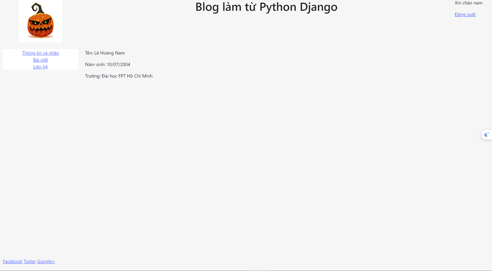

# Blog Template 

## Overview 
A Blog Template written in Django. A mini-website with these applications: 
- Log-in 
- Log-out 
- Storing information, blogs

## Demo 


## Files structure 
```
├── blog
├── home 
├── media
├── PythonWeb
├── db.sqlite3
├── LICENSE
├── manage.py
├── README.md
├── requirements.txt
```

## Installation 
To run this repository, please follow these step: 
1. Install requirement packages:
```
pip install -r requirements.txt
```

2. Run the server:
```
python manage.py runserver
```
3. Open the browser and go to:
```
http://127.0.0.1:8000/
```
4. You can login with the following credentials:
```
username: admin
password: <PASSWORD>
```

## License
The code in this repository is licensed under the MIT License.

Please see LICENSE for details.

## Contact
If you have any questions, please contact me at lenam1072004@gmail.com.


D:\2024\newGithub\pythonWeb\PythonWeb