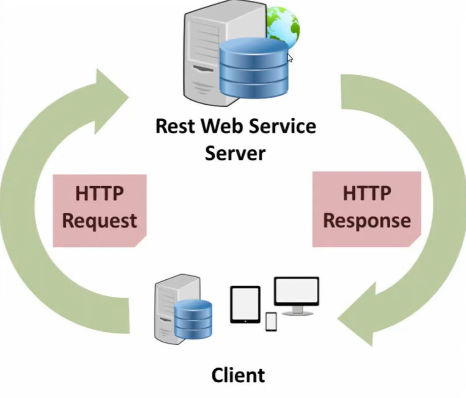

Create new project: python -m django startproject name
Run app: python manage.py runserver 8080 
Create new app: python manage.py startapp home 
Update new app: python manage.py migrate 

Test file: python manage.py test